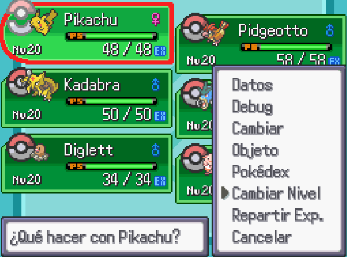
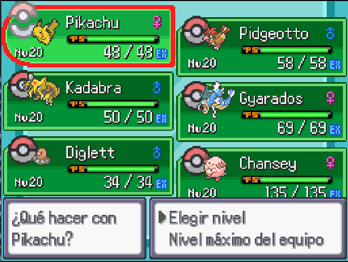
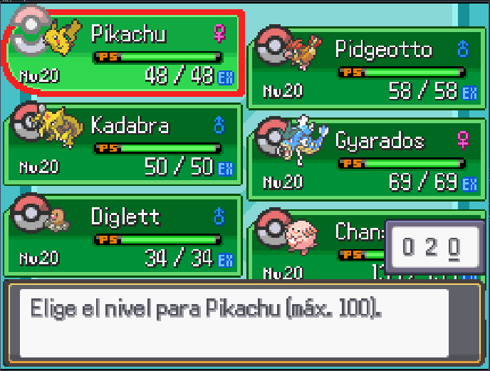

# Set Pokemon Level

## Descripción

Este Plugin agrega una nueva opción al menú del equipo del Pokémon, se puede elegir el nivel a mano o elegir directamente que tome el nivel del pokémon mas alto en el equipo.

Si tienen algun Plugin de Level Caps como LevelCapsEX que modifica el GameData::GrowthRate.max_level, el nivel maximo estará regido por los cambios de ese Plugin.

## Instalación

Solo hay que descargar el zip del release y extraerlo en la carpeta de su juego.